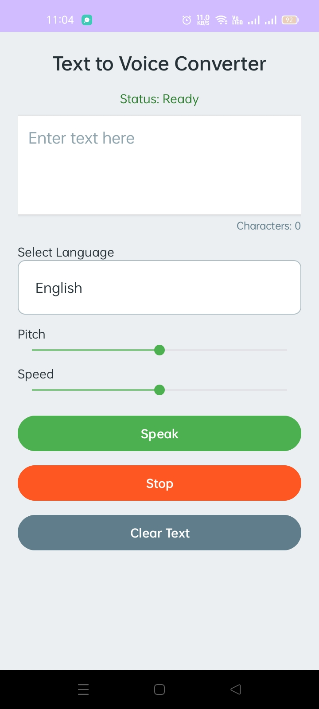
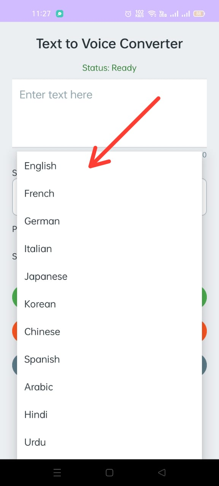
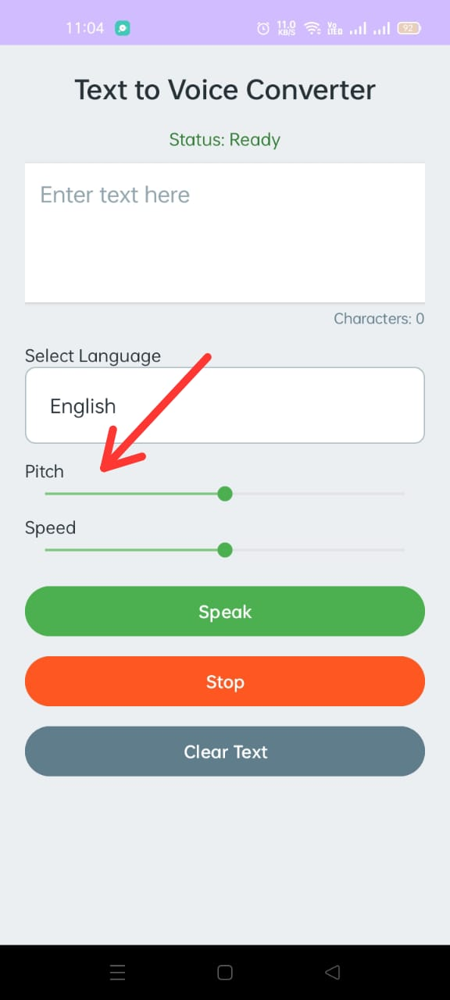
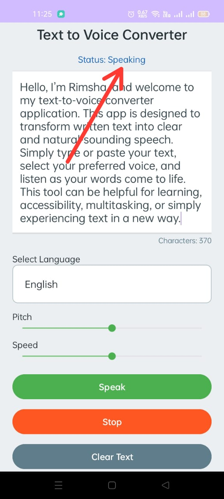
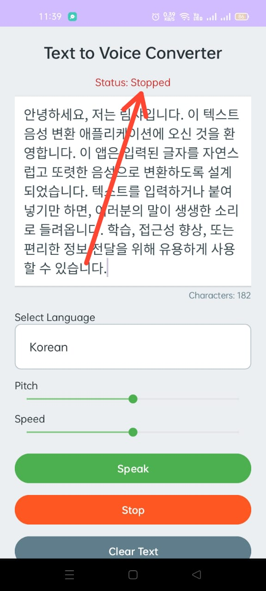

# 🎤 Text to Voice Converter App

Convert text into spoken voice effortlessly with this **Android Kotlin app**!  
The app uses Android’s built-in **TextToSpeech (TTS) API** for instant voice output.

This project focuses on **accessibility, simplicity, and ease of use**. 🚀

---

## ✨ Features

- 📝 Convert text into voice
- 🌐 Supports **15+ languages**
- 🔽 Language selection using **dropdown menu**
- 🎚 Pitch control using **SeekBar**
- ⏩ Speed control using **SeekBar**
- 🔊 Real-time status display (**Ready, Speaking, Stopped**)
- 🔢 Character counter for entered text
- ❌ Clear text button
- 🖥 Simple and user-friendly interface

---

## 📸 Screenshots

| Home Screen | Language Selection |
|-------------|------------------|
|  |  |

| Pitch & Speed | Speaking | Stopped |
|---------------|---------|---------|
|  |  |  |

---

## ▶️ Demo Video

A short demo video of the application is available below: 
[Click here to watch demo video](DemoVideo/app_demo.mp4)

---

## ⚙️ How the App Works

1. User enters text into the input field
2. User selects a language from the dropdown list
3. Pitch and speed are adjusted using sliders
4. Press **Speak** → text is converted to speech
5. **Stop** button stops the speech output
6. **Clear** button resets the input field
7. Status text updates according to the app state

---

## 🛠 Tools and Technologies Used

- Android Studio
- Kotlin
- XML for user interface
- Android TextToSpeech API

---

## 🚀 How to Run the Project

1. Clone or download the repository
2. Open the project in Android Studio
3. Sync Gradle files
4. Run the app on an emulator or physical device

---

## 👩‍💻 Author

**Rimsha Shehzadi**  
Software Engineering  
Government College University, Faisalabad, Pakistan

---

## ⚠️ Note

This project is developed for **educational and learning purposes**.  

